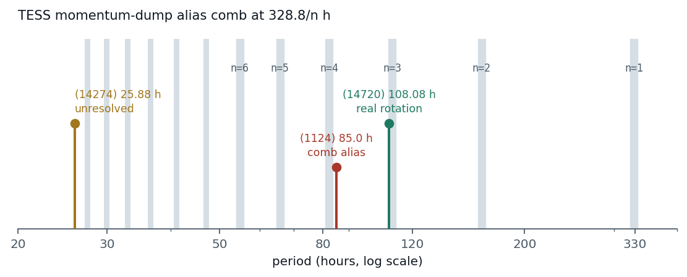
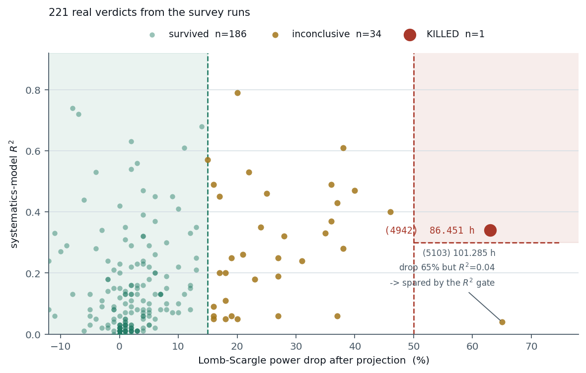
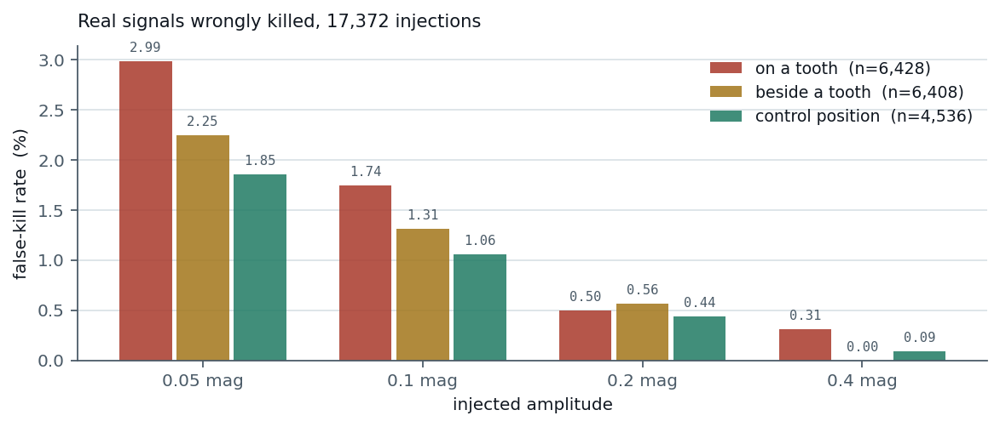
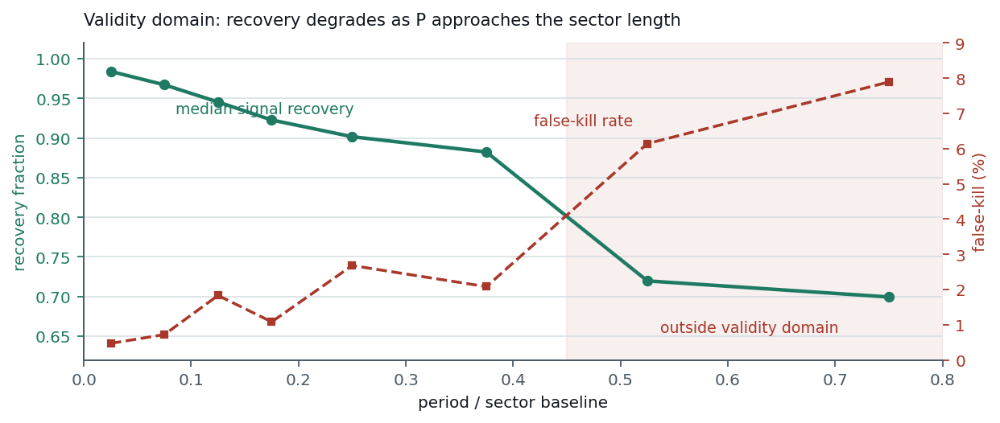

# tess-decomb

[](https://doi.org/10.5281/zenodo.21475149)

Field-star eigen-systematics "de-comb" for TESS moving-target (asteroid)
photometry: separate real rotation signals from the TESS momentum-dump alias
comb (periods at 328.8/n h) and scattered-light systematics, by projecting
each light curve onto an eigen-basis learned from ~200 ordinary field stars
observed in the same sector.

Companion code to the RNAAS research note (Landi 2026, DOI to be added) and
the associated rotation-period survey papers.

---

# How it works

> TESS shakes on a schedule. That shake imprints a fake periodicity on every
> light curve from the same sector. This tool asks one question: if the period
> were real, would the stars know about it too?

*(An interactive version of this walkthrough is in [`docs/explainer.html`](docs/explainer.html).
All figures below are regenerated from committed data by
[`docs/make_figures.py`](docs/make_figures.py).)*

## 1. The problem: the spacecraft has a heartbeat, and it looks like rotation

Every few days TESS fires its thrusters to bleed angular momentum off the
reaction wheels. Those momentum dumps, plus scattered light from Earth and Moon
sweeping the field on the orbital cycle, imprint a repeating pattern on the
photometry. Because the dumps are near-regular, that pattern does not produce
one spurious period, it produces a whole **comb** of them, at roughly
`328.8 / n` hours.



An asteroid light curve is short, sparse and noisy. If its strongest
periodogram peak lands on a comb tooth, the light curve alone cannot tell you
whether you found the body's rotation or the spacecraft's housekeeping. The
figure shows why this cannot be settled with a proximity rule: **(14720)** at
108.08 h sits a hair from the `n=3` tooth at 109.6 h and is a genuine rotation,
while **(1124)** at 85.0 h sits beside the `n=4` tooth and is not. Proximity to
a tooth is a reason for suspicion, never a verdict. It needs a test.

## 2. The idea: the systematics are temporally global

This is the sentence the whole method rests on. The momentum dump does not
happen to your asteroid, it happens to the **spacecraft**. Every source read
out on that CCD at that moment takes the same kick, and the scattered-light
ramp sweeps the entire field.

So the sky is full of witnesses. Ordinary field stars in the same sector are
not rotating asteroids and have no reason to share your candidate period, but
they sat in the same instrument at the same time. Whatever they hold in common
is, by construction, the instrument talking.

> If a periodicity is astrophysical, it belongs to your asteroid alone.
> If it is instrumental, two hundred stars are already carrying it, and you can
> measure it from them and subtract it.

## 3. The recipe, once per sector

1. **Collect witnesses.** Pull ~200 field-star light curves from the target's
   sector. Use SAP flux, not PDCSAP: the standard pipeline already scrubs
   common-mode trends, and those trends are exactly what we want to measure.
   Quality masking stays deliberately light, because reaction-wheel
   desaturation cadences are the signal here, not noise to drop.
2. **Learn the instrument's vocabulary.** Bin every star onto a shared 30-minute
   grid and take the SVD of the resulting (stars x time) matrix. The leading
   right-singular vectors are the shapes the whole field moves in together. Up
   to eight are cached; the top **K = 5** are used.
3. **Subtract what the stars already explain.** Fit the asteroid's unbinned
   light curve as `offset + sum_k c_k * eig_k(t)`, interpolating the
   eigenvectors onto its own timestamps, by linear least squares. Subtract only
   the systematics part; the mean level is preserved exactly.
4. **Ask the periodogram again.** Re-measure Lomb-Scargle power at the candidate
   period on the residual, **harmonic-aware** across `{P/2, P, 2P}` and anchored
   on whichever the sector's genuine detection sits at, each gated by a Baluev
   (2008) false-alarm probability below `1e-3`. A real signal barely notices the
   projection. An instrumental one falls over.

The asteroid never contributes to the basis, so its own rotation cannot be
learned and then removed.

## 4. The awkward part: two pipelines that were never meant to meet

The basis comes from stationary stars in SPOC 2-minute photometry. The target
is a moving aperture tracked across full-frame images (extracted with
`tess-asteroids`, Tuson et al. 2025). Different cadence, different extraction,
different code. Borrowing a correction from one and applying it to the other
deserves suspicion.

The defence is physical: the terms being removed are **spacecraft-** and
**CCD-wide**, not aperture-specific. A thruster firing and a scattered-light
ramp are properties of the observatory and the focal plane, so they survive the
translation between pipelines. Terms that genuinely are aperture-specific, such
as flux spilling across pixel boundaries as the asteroid drifts, are not shared
with the stars and are not what this step claims to fix.

That is an argument, not a proof, which is why it is settled empirically in
step 6.

## 5. The verdict: two numbers, with a deliberate gap between them

After projection you have the fractional drop in periodogram power and the
`R^2` of how much of the light curve the systematics model actually explained.
A large drop from a model that explained nothing is noise, not evidence, which
is why **both** are required to kill.

| Verdict | Rule |
|--|--|
| **SURVIVED** | power drop <= 15% |
| **KILLED** | power drop >= 50% **and** systematics-model `R^2` >= 0.3 |
| **review / inconclusive** | everything else |



Those are 221 real verdicts from the survey runs
(`validation/survey_verdicts.csv`). The mass sits hard against the left edge:
the median surviving period drops **1%** with `R^2 = 0.08`, meaning the
eigen-basis had almost nothing to say about those light curves, which is the
correct outcome for a real rotation. Exactly one object cleared the kill bar.

The near-miss is the most instructive point on the plot. **(5103)** at 101.285 h
suffered the largest power drop in the entire run, 65%, but the systematics
model explained only `R^2 = 0.04` of its light curve, so the `R^2` gate spared
it. Without that second condition it would have been a false kill. The wide
unshaded middle is not indecision either: 34 objects land there and stay
flagged rather than resolved.

## 6. Does it work? Inject known signals and count what you break

The honest failure mode of any systematics removal is eating the science. The
validation injects real and synthetic rotation signals into real light curves,
including signals placed **directly on comb teeth** where the method has the
best excuse to destroy them, then counts how often a genuine signal is killed.



At the weakest amplitude tested (0.05 mag) the method wrongly kills a real
signal about 3% of the time; by 0.2 mag it is under 0.6%, and median power
recovery stays at 94-98% throughout, **including for signals sitting on a
tooth**. That is the empirical answer to the cross-pipeline worry in step 4.

### The asymmetry, and it matters

Run the mirror test, feeding it 46 detections that are known comb artifacts,
and it kills only 6.5% of them: a **false-survive rate near 61%**. The two
verdicts therefore carry very different weight:

- **KILLED is strong evidence** and can be acted on.
- **SURVIVED is weak evidence.** It means this test failed to convict, not that
  the period is proven real.

Use this tool to kill comb artifacts, not to certify on-tooth survivors.

## 7. Where it stops working



Recovery degrades as the period approaches the length of the sector. Below
`P/baseline ~ 0.15` the method is nearly lossless. Past about `0.45`, recovery
falls to ~0.70 and false-kills climb to 6-8%, because a signal completing barely
one cycle in the window is genuinely hard to distinguish from a systematics
trend. Beyond that boundary, prefer multi-sector phase coherence to a
single-sector verdict.

The same logic caps `K`. At `K = 8` the basis becomes flexible enough to start
fitting the asteroid's own rotation: in validation a confirmed 108 h rotation
lost 4.7% of its power, and a synthetic 90 h injection came back with 83% of its
amplitude and a period error 150 times worse than at `K = 5`. More components
remove more instrument, and then they start removing the science.

---

## Method in one paragraph

SPOC 2-min SAP light curves of ~200 field stars from the target's sector are
median-binned onto a common 30-min grid; the SVD of the (stars x time) matrix
yields the sector's shared instrumental time series ("eigen-systematics").
An asteroid's unbinned light curve is then fitted as offset + a linear
combination of the top K = 5 eigen-vectors interpolated to its own
timestamps, and the systematics part is subtracted. A candidate period is
judged harmonic-aware ({P/2, P, 2P}, each gated by Baluev FAP < 1e-3):
a detection whose Lomb-Scargle power drops >= 50% under projection (with
systematics-model R^2 >= 0.3) is instrumental; a drop <= 15% survives.
Verdicts are anchored on the strongest detection and survival-first across
sectors.

## Validated performance (full campaign in `validation/`)

| Test | Result |
|--|--|
| V1 holdout-K | verdicts plateau for K in 2-8; ground-truth cases bracket K in [4, 5] |
| V2 17,372 injections | false-kill 3% -> 0% with amplitude; recovery 94-98%, incl. on-tooth periods |
| V3 null test | 61% of pure comb detections SURVIVE -> survival is weak evidence; the kill side is the calibrated side |
| V4 ROC | kill thresholds sit at the knee: 1.13% false-kill at 6.5% of injections killed; no survive threshold separates the populations |
| V5 bootstrap | 77% verdict stability across 6 resampled ensembles, 89% disjoint-halves agreement, zero confirmed-object flips |
| V6 validity domain | retention >= 88% and false-kill <= 3% up to P = 0.45x sector baseline; ~70% beyond |
| V7 joint fit | simultaneous basis+Fourier fit removes slow-rotator over-subtraction in-domain, but 96% false-clear on comb nulls: architecture is "sequential kills; joint measures" |

Two design consequences worth internalizing before use:
1. **Asymmetry.** Use this tool to KILL comb artifacts, not to certify on-tooth
   survivors. Survival gains credibility; it does not prove a period.
2. **Validity domain.** Trust verdicts for periods up to ~0.45x the sector
   baseline (~250 h for a full sector); beyond that, prefer multi-sector
   phase coherence.

## Install

```bash
pip install numpy pandas astropy astroquery requests
pip install -e .
```

## Usage

```bash
# one-time per sector: build the eigen-basis from MAST (public SPOC data)
tess-decomb ensemble --sector 18

# de-comb a light curve (CSV: time [BTJD days], mag, err)
tess-decomb decomb --lc my_asteroid_s18.csv --sector 18 --k 5 --out decombed.csv

# harmonic-aware verdict for a candidate period across sectors
tess-decomb-check --period 25.876 --lc lc_s94.csv:94 --lc lc_s36.csv:36

# self-contained smoke test (synthetic injection on a held-out field star)
tess-decomb validate --sector 18
```

Python API: `build_eigenbasis`, `fit_and_subtract`, `decomb_asteroid`
(`tess_decomb.sysrem`), `check_period` (`tess_decomb.check`).

The eigen-basis cache defaults to `./sysrem_cache` (override with the
`TESS_DECOMB_CACHE` environment variable). Building one sector downloads
~220 SPOC light curves (~8 min) once; everything after is offline.

## Repository layout

- `tess_decomb/` -- the module (eigen-basis, projection, verdict CLI).
- `docs/` -- the explainer above: `make_figures.py` (regenerates every figure
  from committed data), `figures/`, and a self-contained interactive version
  in `explainer.html`.
- `validation/` -- the V1-V7 validation campaign: results documents, raw
  artifacts (17,372-injection table, null tests, bootstrap, validity curve,
  and `survey_verdicts.csv`, the 221 real verdicts plotted above), and the
  campaign scripts (archival: they ran against the survey's internal
  directory layout and are included for transparency, not as runnable tools).

## Citing

If you use this code, cite the RNAAS note (DOI to be added on publication)
and the archived software (doi:10.5281/zenodo.21475149; all versions:
doi:10.5281/zenodo.21443303; see `CITATION.cff`). The method builds on SysRem
(Tamuz, Mazeh & Zucker 2005) and the TFA/CBV family of ensemble-systematics
approaches (Kovacs et al. 2005; Smith et al. 2012), applied to moving-target
photometry extracted with `tess-asteroids` (Tuson et al. 2025).

### Which version does the research note describe?

The RNAAS note cites **v0.1.0** (doi:10.5281/zenodo.21443304), and that is the
archive to consult when checking the note's numbers. Releases since then change
documentation and validation artifacts only: the `tess_decomb` package code,
the thresholds, and every reported verdict are unchanged from v0.1.0. The
version DOI in the note therefore remains the correct citation for it, and
resolves permanently.

| Release | DOI | Package code |
|--|--|--|
| v0.1.0 (cited by the note) | [10.5281/zenodo.21443304](https://doi.org/10.5281/zenodo.21443304) | baseline |
| v0.1.1 (this README, explainer + figures) | [10.5281/zenodo.21475149](https://doi.org/10.5281/zenodo.21475149) | unchanged |
| latest, whichever that is | [10.5281/zenodo.21443303](https://doi.org/10.5281/zenodo.21443303) | -- |

## License

MIT (see LICENSE).
